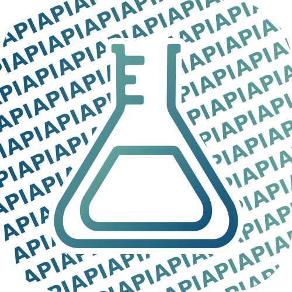

[*Back to APIs*](https://github.com/KristofKekesi/APIs#readme)
<p align="center">
   </p>
<h1 align="center">
  Elements API
</h1>

 [](https://discord.gg/7URAMuc)

## Contributors 
* _[Programming]_  - [__Kristóf Kékesi__](https://github.com/KristofKekesi)
 
## Contacts [](https://discord.gg/7URAMuc)

<table>
 <tr><td>
  Discord:
 </td><td>
  https://discord.gg/7URAMuc
 </td></tr>
 <tr><td>
  mail:
 </td><td>
  kristofkekesiofficial@gmail.com
 </td></tr>
</table>

## Documentation

#### Get all elements
```http
GET https://api.kekesi.dev/Elements/v1/element/data.json
```

#### Get specified element
```http
GET https://api.kekesi.dev/Elements/v1/element/[ELEMENTSNUMBER]/data.json
```

#### Get all isotopes
```http
GET https://api.kekesi.dev/Elements/v1/element/1/isotope/data.json
```

#### Get all isotopes
```http
GET https://api.kekesi.dev/Elements/v1/element/1/isotope/[ISOTOPENUMBER]/data.json
```
